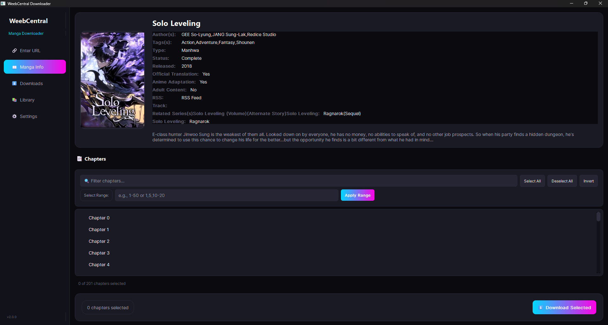

<div align="center">

# 📚 WeebCentral Manga Downloader

**A powerful, modern manga downloader with a stunning Neon Noir GUI**

[](https://python.org)
[](https://pypi.org/project/PyQt6/)
[](LICENSE)
[](https://colab.research.google.com/github/Yui007/weebcentral_downloader/blob/main/colab/WeebCentral_Downloader.ipynb)

<br>



<br>

🧩 **Don't want to use a script?** Try the [Browser Extension](https://github.com/Yui007/weebcentral_extension)!

</div>

---

<div align="center">

## ✨ Features

</div>

<table align="center">
<tr>
<td width="50%">

### 🎨 Modern GUI
- **Neon Noir** design with cyan/magenta accents
- Animated buttons with glow effects
- Smooth transitions and glassmorphism panels
- **Granular real-time progress bars** showing image counts (e.g., 12/55)

</td>
<td width="50%">

### ⚡ Performance
- **Parallel chapter downloads** (1-8 concurrent)
- **Parallel image downloads** (1-10 per chapter)
- Checkpoint system for resume
- Smart caching and retry logic

</td>
</tr>
<tr>
<td width="50%">

### 📖 Chapter Selection
- Download single chapter: `5` or `23.5`
- Download range: `1-50` or `5.5-15.5`
- Quick range input: `1,5,10-20`
- Select all with one click

</td>
<td width="50%">

### 📦 Export Options
- **PDF conversion** with proper sizing
- **CBZ archives** for comic readers
- Auto-delete images after conversion
- Organized folder structure

</td>
</tr>
</table>

---

## ☁️ Google Colab

Run directly in your browser - no installation needed!

[](https://colab.research.google.com/github/Yui007/weebcentral_downloader/blob/main/colab/WeebCentral_Downloader.ipynb)

1. Click the badge above to open the notebook
2. Run **Cell 1** to install dependencies and clone the repository
3. Run **Cell 2** — paste your manga URL, select chapters & format
4. Optionally run **Cell 3** to zip and download to your PC

**Output formats:** `pdf`, `cbz` (with ComicInfo.xml for Kavita/Komga), `images`, or `all`

---

## 🚀 Quick Start

## Requirements

- Python 3.8+
- [FlareSolverr](https://github.com/FlareSolverr/FlareSolverr) (**Optional** — only needed if the site enables Cloudflare protection)

## Setup

1.  **Clone the Repository**
    ```bash
    git clone https://github.com/Yui007/weebcentral_downloader.git
    cd weebcentral_downloader
    ```

2.  **Install FlareSolverr (Optional)**
    
    > **Note:** FlareSolverr is **not required** for normal use. The downloader connects directly to the site. FlareSolverr is only used as an automatic fallback if Cloudflare protection is detected (e.g., 403/503 challenge pages). You can skip this step entirely unless you encounter Cloudflare blocks.
    
    *   Download the latest release from [FlareSolverr Releases](https://github.com/FlareSolverr/FlareSolverr/releases).
    *   Extract and run the executable (`flaresolverr.exe` on Windows).
    *   Ensure it is running on the default port `8191`.

3.  **Install Python Dependencies**
    ```bash
    pip install -r requirements.txt
    ```

4.  **Run the Downloader**
    *   **GUI Mode:**
        ```bash
        python run_gui.py
        ```
    *   **CLI Mode:**
        ```bash
        python weebcentral_scraper.py
        ```

---

## 🎮 GUI Overview

| Tab | Description |
|-----|-------------|
| 🔗 **URL Input** | Paste manga URL, view recent history, fetch manga info |
| 📖 **Manga Info** | View cover, metadata, tags, and select chapters to download |
| ⬇️ **Downloads** | Real-time progress bars with image counts, parallel downloads |
| 📚 **Library** | Browse downloaded manga, track missing chapters, and batch convert |
| ⚙️ **Settings** | Configure threads, delay, output folder, conversion options |

### Settings Available

| Setting | Range | Description |
|---------|-------|-------------|
| Concurrent Chapters | 1-8 | How many chapters download in parallel |
| Concurrent Images | 1-10 | Images per chapter downloaded simultaneously |
| Request Delay | 0.5-5.0s | Delay between requests |
| Convert to PDF | ✓/✗ | Auto-convert chapters to PDF |
| Convert to CBZ | ✓/✗ | Auto-convert chapters to CBZ |
| Delete After | ✓/✗ | Remove images after conversion |

---

## 📁 Project Structure

```
weebcentral_downloader/
├── run_gui.py              # GUI entry point
├── weebcentral_scraper.py  # CLI & core scraper
├── weebcentral_gui.py      # Legacy GUI (deprecated)
├── gui/
│   ├── __init__.py         # App initialization
│   ├── main_window.py      # Main window & navigation
│   ├── theme.py            # Neon Noir design system
│   ├── config.py           # JSON settings manager
│   ├── animations.py       # Glow & fade effects
│   ├── components/         # Reusable widgets
│   │   ├── animated_button.py
│   │   ├── animated_input.py
│   │   ├── chapter_list.py
│   │   ├── download_card.py
│   │   └── manga_info_card.py
│   ├── tabs/               # Tab views
│   │   ├── url_input_tab.py
│   │   ├── manga_info_tab.py
│   │   ├── downloads_tab.py
│   │   └── settings_tab.py
│   └── workers/            # Background threads
│       ├── scraper_worker.py
│       ├── download_worker.py
│       └── conversion_worker.py
└── downloads/              # Default output folder
```

---

## 📋 Requirements

```
Python >= 3.8
requests >= 2.31.0
beautifulsoup4 >= 4.12.0
tqdm >= 4.66.1
PyQt6 >= 6.5.0
fpdf2 >= 2.7.4
Pillow >= 9.3.0
```

---

## 🤝 Contributing

Contributions are welcome! Feel free to:

- 🐛 Report bugs
- 💡 Suggest features
- 🔧 Submit pull requests

### ✨ Top Contributors

- **[TheHappyAkita](https://github.com/TheHappyAkita)**: Huge contribution with PR #15 (Library Tab, improved rate limiting, and core stability).

---

## ⚠️ Disclaimer

This tool is for **educational purposes only**. Please respect the terms of service of the websites you interact with.

---

<div align="center">

**Made with ❤️ by [Yui007](https://github.com/Yui007)**

⭐ Star this repo if you find it useful!

</div>