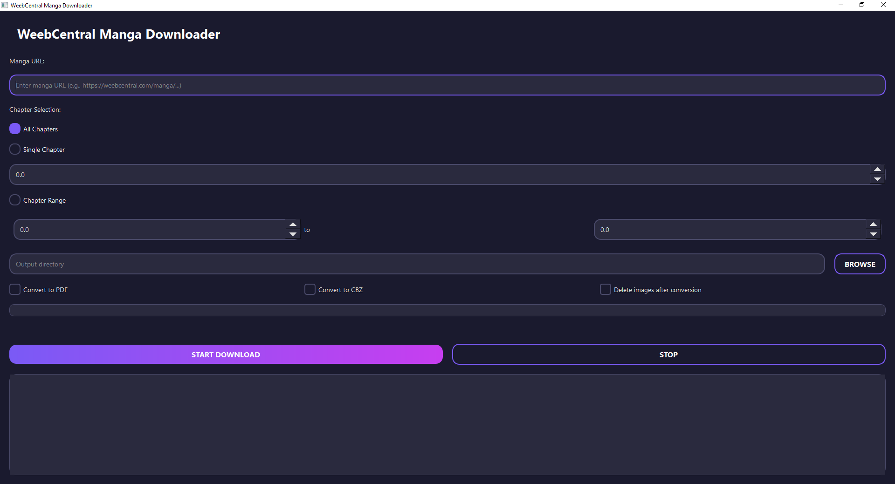

<div align="center">

# 📚 WeebCentral Manga Downloader

**A powerful, modern manga downloader with a stunning Neon Noir GUI**

[](https://python.org)
[](https://pypi.org/project/PyQt6/)
[](LICENSE)
[](https://colab.research.google.com/github/Yui007/weebcentral_downloader/blob/main/colab_run.ipynb)

<br>



<br>

🧩 **Don't want to use a script?** Try the [Browser Extension](https://github.com/Yui007/weebcentral_extension)!

</div>

---

<div align="center">

## ✨ Features

</div>

<table align="center">
<tr>
<td width="50%">

### 🎨 Modern GUI
- **Neon Noir** design with cyan/magenta accents
- Animated buttons with glow effects
- Smooth transitions and glassmorphism panels
- Real-time progress bars per chapter

</td>
<td width="50%">

### ⚡ Performance
- **Parallel chapter downloads** (1-8 concurrent)
- **Parallel image downloads** (1-10 per chapter)
- Checkpoint system for resume
- Smart caching and retry logic

</td>
</tr>
<tr>
<td width="50%">

### 📖 Chapter Selection
- Download single chapter: `5` or `23.5`
- Download range: `1-50` or `5.5-15.5`
- Quick range input: `1,5,10-20`
- Select all with one click

</td>
<td width="50%">

### 📦 Export Options
- **PDF conversion** with proper sizing
- **CBZ archives** for comic readers
- Auto-delete images after conversion
- Organized folder structure

</td>
</tr>
</table>

---

## 🚀 Quick Start

### Installation

```bash
# Clone the repository
git clone https://github.com/Yui007/weebcentral_downloader.git
cd weebcentral_downloader

# Install dependencies
pip install -r requirements.txt
```

### Launch the GUI

```bash
python run_gui.py
```

### Or use Command Line

```bash
python weebcentral_scraper.py
```

---

## 🎮 GUI Overview

| Tab | Description |
|-----|-------------|
| 🔗 **URL Input** | Paste manga URL, view recent history, fetch manga info |
| 📖 **Manga Info** | View cover, metadata, tags, and select chapters to download |
| ⬇️ **Downloads** | Real-time progress bars, parallel downloads, cancel option |
| ⚙️ **Settings** | Configure threads, delay, output folder, conversion options |

### Settings Available

| Setting | Range | Description |
|---------|-------|-------------|
| Concurrent Chapters | 1-8 | How many chapters download in parallel |
| Concurrent Images | 1-10 | Images per chapter downloaded simultaneously |
| Request Delay | 0.5-5.0s | Delay between requests |
| Convert to PDF | ✓/✗ | Auto-convert chapters to PDF |
| Convert to CBZ | ✓/✗ | Auto-convert chapters to CBZ |
| Delete After | ✓/✗ | Remove images after conversion |

---

## ☁️ Google Colab

Run directly in your browser - no installation needed!

[](https://colab.research.google.com/github/Yui007/weebcentral_downloader/blob/main/colab_run.ipynb)

1. Click the badge above
2. Run cells in order
3. Follow prompts to download
4. Use compression tools for easier export

---

## 📁 Project Structure

```
weebcentral_downloader/
├── run_gui.py              # GUI entry point
├── weebcentral_scraper.py  # CLI & core scraper
├── weebcentral_gui.py      # Legacy GUI (deprecated)
├── gui/
│   ├── __init__.py         # App initialization
│   ├── main_window.py      # Main window & navigation
│   ├── theme.py            # Neon Noir design system
│   ├── config.py           # JSON settings manager
│   ├── animations.py       # Glow & fade effects
│   ├── components/         # Reusable widgets
│   │   ├── animated_button.py
│   │   ├── animated_input.py
│   │   ├── chapter_list.py
│   │   ├── download_card.py
│   │   └── manga_info_card.py
│   ├── tabs/               # Tab views
│   │   ├── url_input_tab.py
│   │   ├── manga_info_tab.py
│   │   ├── downloads_tab.py
│   │   └── settings_tab.py
│   └── workers/            # Background threads
│       ├── scraper_worker.py
│       └── download_worker.py
└── downloads/              # Default output folder
```

---

## 📋 Requirements

```
Python >= 3.8
requests >= 2.31.0
beautifulsoup4 >= 4.12.0
selenium >= 4.15.0
tqdm >= 4.66.1
PyQt6 >= 6.5.0
fpdf2 >= 2.7.4
Pillow >= 9.3.0
```

---

## 🤝 Contributing

Contributions are welcome! Feel free to:

- 🐛 Report bugs
- 💡 Suggest features
- 🔧 Submit pull requests

---

## ⚠️ Disclaimer

This tool is for **educational purposes only**. Please respect the terms of service of the websites you interact with.

---

<div align="center">

**Made with ❤️ by [Yui007](https://github.com/Yui007)**

⭐ Star this repo if you find it useful!

</div>